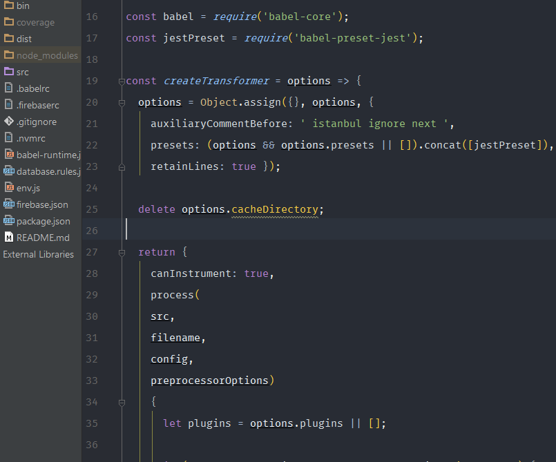

# ivan-jetbrains-settings

Installation
------------

### Settings

Import settings from settings.jar

### Syntax highlight

    Note: Looks like the newer version of PhpStorm changed the location of the files, It now seems to be:

    On Mac it is in `~/Library/Preferences/PhpStorm<version>/colors`.

    Where <version> is 2016.1 currently (i.e. PhpStorm2016.1/colors)

1.  Copy `Ivan Colors.icls` to your PhpStorm preferences:
  - On Linux it is in  `/home/<username>/.WebIde<version>0/config/colors`.
  - On Mac it is in `~/Library/Preferences/WebIde<version>0/colors`.
  - On Windows it is in `C:\Users\<username>\.WebIde<version>0\config\colors`.

  Replace `WebIde<version>0` with the Version of PhpStorm you use, e.g. WebIde70 for PhpStorm 7

2. Restart PhpStorm

3. Go to `Preferences | Editor | Colors & Fonts` and select Ivan Colors.

### Settings

The font used in the screenshot is [Fira Mono](https://github.com/mozilla/Fira).
